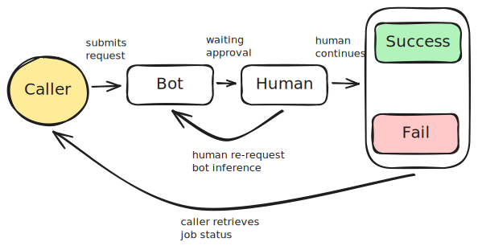

# HITL AI Inference Middleware

This Rust project utilizes the Axum framework to build a web microservice middleware that facilitates AI inference
tasks. Essentially human-in-the-loop (HITL) system where AI inferences are queued for human review before the results
are sent back to the user.

This system uses RabbitMQ for message queuing for spinning up multiple Axum instances and PostgreSQL to persist
data.

## Overview

This middleware acts as an intermediary, receiving AI inference requests from users, queuing them in RabbitMQ, and
processing them through an external AI model. After inference, a human reviewer approves or modifies the AI's decision,
ensuring accuracy and reliability before the results are delivered back to the user.

### Job types

There are 4 different job types 'bot', 'human', 'success', 'fail'.




## Features

- **AI Request Handling:** Receive and validate AI inference requests.
- **RabbitMQ Integration:** Queue requests using Lapin for efficient message handling.
- **Human Review System:** Incorporate a HITL system to approve AI inferences.
- **Result Delivery:** Send the approved results back to the user.

## Requirements

- Rust
- RabbitMQ
- PostgreSQL
- Any external AI model for inference

## Getting Started Locally

1. Ensure you have Rust installed. If not, install it using [rustup](https://rustup.rs/):
2. Clone the repository
3. Start RabbitMQ and Postgres instance
    1. using docker compose `docker compose -f docker/docker-compose.yml up -d`
    2. or alternatively edit `.env` file to point to instances.
4. Modify your external API call in [src/mq.rs](src/mq.rs)
5. Run `cargo run`
6. It should be live on `localhost:3000`

## Usage

### Enqueue a job

```shell
# Adjust payload to how the API was originally called.
curl -X POST http://localhost:3000/enqueue -d '{ "input": "What is 2 + 2?" }'
```

Responds with job_id

### Retrieving the response

```shell
curl http://localhost:3000/job?id=12345678
```

Responds with

```json
{
  "job_id": "12345678",
  "status": "success",
  "payload": {},
  "response": {},
  "created_at": "2024-05-01T07:31:28.951099Z"
}
```

For example using DeepInfra:

```json
{
  "job_id": "whZyUANi",
  "status": "Human",
  "payload": {
    "messages": [
      {
        "content": "Hello!",
        "role": "user"
      }
    ],
    "model": "meta-llama/Meta-Llama-3-70B-Instruct"
  },
  "response": {
    "choices": [
      {
        "finish_reason": "stop",
        "index": 0,
        "message": {
          "content": "Hello! It's nice to meet you. Is there something I can help you with, or would you like to chat?",
          "name": null,
          "role": "assistant",
          "tool_calls": null
        }
      }
    ],
    "created": 1714250362,
    "id": "chatcmpl-2b362634cca763acae32e9de234123ee",
    "model": "meta-llama/Meta-Llama-3-70B-Instruct",
    "object": "chat.completion",
    "usage": {
      "completion_tokens": 25,
      "estimated_cost": 0.000026829999999999,
      "prompt_tokens": 12,
      "total_tokens": 37
    }
  },
  "created_at": "2024-05-01T06:03:22.233232Z"
}
```

### Listing jobs

```shell
curl http://localhost:3000/jobs?offset=0&limit=50&status=human
```

### Human reviewing jobs

```shell
curl -X POST http://localhost:3000/reviewJob -d '{ "id": "12345678", "status": "success" }'
```

With reviewing jobs, parameters you can edit are:

- `status` - can set to `bot`, `success`, `fail` (setting `human` type does nothing)
- `response` - edit the output
- `payload` - edit the input (regenerates new response if set status as bot) 